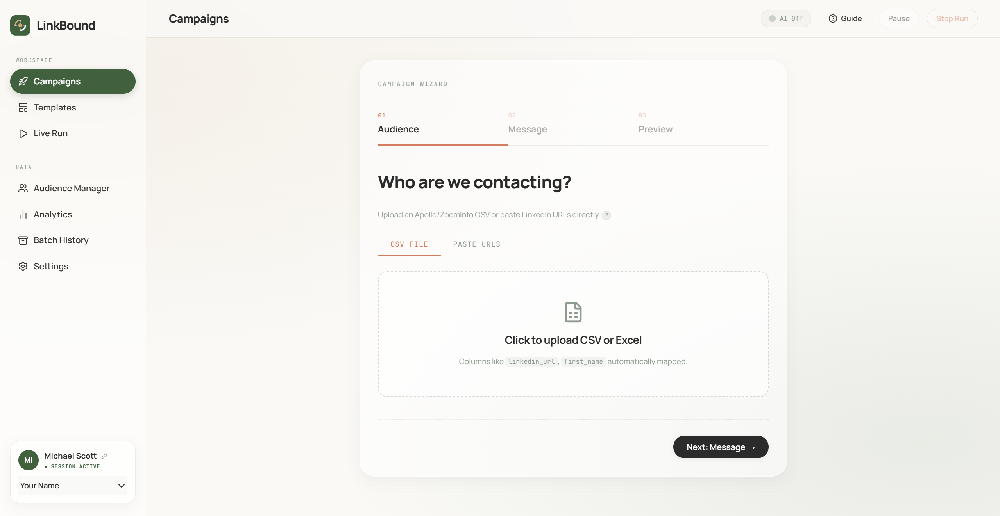

# LinkBound: Outbound Automation



LinkBound is a localized control center for managing LinkedIn outreach. We built it to solve a specific problem: most automation tools act like spam cannons that jeopardize account safety. LinkBound runs locally on your own machine using your own Chrome profile. It navigates LinkedIn the way a human does, enforcing hard safety limits while using AI to personalize notes based on the prospect's actual profile.

## What It Actually Does

LinkBound manages the entire outbound flow safely from your laptop. 

1. **Load Your Audience:** Paste raw LinkedIn URLs or upload a CSV export. 
2. **AI Personalization:** Using Gemini 3.5 Flash, the engine reads the prospect's profile live. It cleans up concatenated names and tailors your base template to match their headline, company, and background.
3. **Smart Execution:** The engine detects page states and acts accordingly. If you are already connected, it sends a direct message. If not, it sends a connection request with the tailored note. 
4. **Local Memory:** Every interaction logs to a local SQLite database (`outbound.db`). The system automatically deduplicates contacts across campaigns, guaranteeing you never double-message someone.

## New in v2.0

The latest version includes a complete frontend overhaul to the Liquid Clarity design language, alongside architectural upgrades for better scale and safety.

- **Bring Your Own Gemini Key:** The server has a fallback free-tier key. You can now plug in your own API key directly from the Settings tab to bypass rate limits or access Gemini 3.1 Pro. This saves securely in your browser and injects via headers.
- **Audience Manager (CRM):** A unified view of every single person you have contacted. You can search, filter, and export records directly to CSV.
- **Batch Tracking:** Campaigns are tracked as specific batches. You know exactly how many requests succeeded, failed, or were skipped.
- **Anti-AI Review:** Before launching, you can pass your templates through the built-in Anti-AI reviewer. It aggressively flags clichés and hype language to keep your voice genuinely human.

## Getting Started

You need **Python 3.10+** and **Google Chrome** installed on your machine.

1. Clone or download this repository.
2. Open your terminal in this folder.
3. Run the bootstrap script:
   ```bash
   python bootstrap.py
   ```
   (On macOS, use `python3 bootstrap.py`)

The script builds your virtual environment, installs the dependencies (`requirements.txt`), sets up the browser context, and launches the FastAPI server.

4. Go to **http://127.0.0.1:8000** in your browser.
5. In `config.yaml`, add your name under `operators`.
6. On your first run, Chrome will open. Log into LinkedIn, clear any 2FA, and the session saves persistently.

## Deploying to Railway

If you want to host this for your team, the repository is configured for Railway out of the box.

1. Push this repo to GitHub.
2. Connect the repo in Railway.
3. Railway automatically detects the `Dockerfile` and `railway.json`.
4. **Crucial Step:** Attach a Volume to `/app/data` in the Railway dashboard. This ensures your SQLite database and persistent browser profiles survive server restarts.

## A Note on Safety

LinkedIn aggressively monitors automation. We built LinkBound to protect the sender account. The default daily cap is 22 profiles. The engine inserts randomized human delays between actions. Do not push this to 100+ requests a day. Quality outreach will always outperform raw volume.
