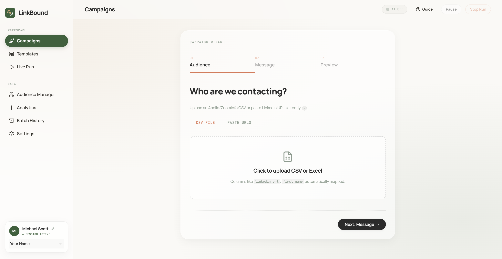

# LinkBound

LinkBound is a local LinkedIn outreach workspace. It imports contact lists, previews and sends outreach through a headed Chrome browser, queues campaigns, and records contact and inbox activity in SQLite. LinkedIn access is browser-only; the app does not use a LinkedIn API.

## Features

- **Campaigns:** import a CSV or Excel file, or paste LinkedIn profile URLs. Choose an action and message, preview each row, and run immediately or queue daily chunks.
- **Sending controls:** separate rolling limits for invitations and direct messages, a dry run for immediate campaigns, stop conditions, and an uncertain-send state for cases that need manual review.
- **Sessions and contacts:** each sender uses a separate persistent Chrome profile. Contacts, campaign history, and inbox observations are associated with the sender account.
- **Inbox and CRM:** browser-based conversation checks, saved messages and files, contact status, review controls, and CSV exports. Automatic inbox scanning is disabled by default.
- **Templates and AI:** reusable message templates and optional Gemini-assisted drafting.
- **Exit nodes:** a hosted installation can require a selected Tailscale exit node before LinkedIn browser activity. The local setup does not require Tailscale.

## Run locally

1. Install Python 3.12 and Google Chrome.
2. Run `python bootstrap.py` from this directory. It creates a virtual environment, installs dependencies, and starts the dashboard. On Windows, `start.ps1` does the same.
3. Open the local address printed by the launcher, normally <http://127.0.0.1:8000>.
4. Sign in to LinkedIn in the visible Chrome window and complete any account verification. The browser profile is kept in the ignored `profiles/` directory.
5. In **Campaigns**, import contacts, choose an action, inspect the preview, and use **Dry Run** before a real send. Check **Live Run** and **Batch History** for results.

Edit `config.yaml` for sender profiles and local limits. Copy `.env.example` to `.env` for optional keys and environment settings. The `.env`, `data/`, and `profiles/` paths are ignored by Git and must never be committed. Queue jobs can send real outreach when due; the immediate-run Dry Run setting does not cover queued campaigns.

The numeric limits in `config.yaml` are operator settings, not published LinkedIn allowances or a guarantee against account restrictions. Use the tool only with accounts you are authorized to operate.

## Development

Run `python -m pytest -q` from the project root. `requirements-linux.lock` pins a Linux/Python 3.12 environment; `requirements.txt` supports the local launcher.

This public repository contains application code and generic configuration. It does not contain a hosted deployment or any account's browser profile, messages, database, or credentials.
