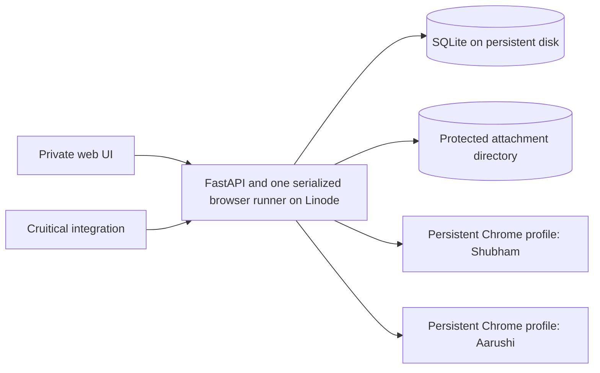

# LinkBound v3 architecture and delivery plan

Status: revised after scope and access review, 2026-09-23. This is a focused internal operations tool, not a general CRM platform.

## Outcome

LinkBound becomes a continuously available internal outbound operations system. Shubham can switch among distinct LinkedIn accounts, queue large campaigns, see accepted requests and replies, inspect and export shared files, and promote qualified candidates into Cruitical. Each account retains its own browser login, limits, contact history, and sync health. The existing browser send path remains the reference implementation until a specific defect is reproduced and fixed.

## Evidence and constraints

- The current app has a FastAPI dashboard, a Playwright persistent Chrome context per operator, SQLite contact and batch records, and an MCP and HTTP client. The local database contains completed outbound batches.
- The `contacts` table has one row per URL and one mutable `operator` and `last_status`. This loses account context and can erase dedup evidence. Previewed dedup is not checked again before a send.
- Dashboard runs use per-operator orchestrators. The `/api/v1/enqueue` route uses another global orchestrator. Its batch ID is assigned asynchronously after the route can return.
- Campaign scheduling currently marks a due campaign `running` without target rows or sends. Upload previews live only in process memory.
- The existing dashboard routes, WebSocket, export, and file route have no authentication. The API key protects only `/api/v1/*`.
- The current Dockerfile installs Chromium, while configuration requests headed Google Chrome. Its Playwright image and Python package versions are not pinned together.
- The session picker changes the visible account name, but the current CRM query remains global and limited. The Safety Limits Save control does not persist the entered values.
- LinkedIn says third-party tools that automate activity on its website violate its rules. A headed browser and the user's report of no account notices so far do not establish future non-detection. LinkedIn does not publish 100 daily invitations as a safe allowance. The user-defined cap is an internal ceiling, not a platform guarantee.
- The [LinkedIn access risk review](linkbound-linkedin-access-risk-review.md) records LinkedIn's published device, network, cookie, challenge, and activity signals against the local and hosted browser setup. Its account-risk gate must be reviewed before any hosted sends; there is no documented safe fingerprint or detection threshold to implement.
- Cruitical's current admin candidate creation and resume upload routes require a human admin credential. Admin creation makes a claimable user, resume upload can overwrite an existing file, and passport regeneration can interrupt an existing run. They are not a safe automatic import contract yet.

## Scope guardrails

The [CRM benchmark](linkbound-v3-crm-benchmark.md) gives useful logical distinctions. It is a reference catalog, not a list of tables to implement. The first version serves one app user, a few LinkedIn sender accounts, one outbound action per campaign, daily no-send sync, and one Cruitical handoff. Keep the existing Playwright send path and `sqlite3` persistence. Add a table only when a requested workflow needs independent state or a database constraint.

All LinkedIn operations use the existing browser automation approach. No LinkedIn API or partner integration is in scope. LinkBound's own API and the Cruitical handoff API remain separate requirements.

The first technical proof is a headed Chrome pilot on Linode with one account, persistent profile, and no-send navigation. It happens before a large queue or CRM build. A new IP and Linux environment may change account behavior; the pilot cannot guarantee the present account experience. If it succeeds, host the app, browser, SQLite, and attachments on one private Linode VM. If it fails, a Linode dashboard with the current local browser is a fallback, with the explicit limitation that scheduled sends and sync stop when the local machine is offline. A remote worker protocol is built only if that fallback becomes necessary.

Run one app process and one active browser context at a time. Browser operations and inbound sync share the same account lock. Profile directories are never shared between simultaneous Chrome processes. Keep the local working setup as a rollback path during the hosted pilot.

## Minimum data changes

1. Reuse `operators` as LinkedIn sender accounts and make the UI label clear. Reuse `contacts` for global profile details, but stop using its mutable `operator` and `last_status` as outreach truth. Normalize URL variants consistently; add a URL alias table only if actual redirects or collisions require it.
2. Add `account_contacts` keyed by `(operator, normalized_linkedin_url)` for each sender's relationship and last observed connection state. Reconstruct prior sends from existing `outbound_requests`, never from the latest contact status. A later skip cannot erase a prior send. Cross-account suppression queries confirmed history and an explicit do-not-contact flag; richer suppression policies wait until needed.
3. Reuse `campaigns`. Add durable `campaign_targets` with campaign ID, normalized URL, source job, due time, claim state, batch ID, and outcome request ID. For one action per campaign, a target can represent both enrollment and queued work. Keep `outbound_requests` as immutable attempt records and add `outreach_uncertainties` for actions that might have sent without a confirmed result, including immediate runs. The target points to its attempt record; a second campaign can reference the same global person only after prior outreach is resolved under suppression policy.
4. When inbound sync ships, add `conversations`, `messages`, `attachments`, and `sync_runs`, all scoped to the sender account. A conversation can have a nullable contact link while an unmatched reply is reviewed. Keep source timestamps and provider IDs when exposed; ambiguous fingerprints stay visible. Model one-to-one conversations first. Store file bytes outside SQLite and tie every attachment to its source message.
5. When Cruitical promotion ships, add one idempotent `integration_deliveries` record per source promotion. Store the permission decision and evidence used for that delivery. Define the candidate permission rule before automatic imports.

The contact page derives `invited`, `accepted`, `replied`, and `file_received` from the existing request history plus new sync observations. These facts can coexist. Pending invitation disappearance is not acceptance evidence. Display source and last observed time. Keep LinkedIn unread separate from LinkBound reviewed state.

Release A uses explicit SQLite `user_version` migrations with runtime `sqlite3`. This keeps the one migration in the existing persistence layer; introduce Alembic when the migration set or release process warrants a separate tool. Back up the SQLite file before applying a migration, use a deliberate busy timeout, and reconcile legacy request counts. Foreign key enforcement waits until legacy batch references have been audited and the remaining `batch_id or 0` fallback is removed. Do not infer acceptance or replies from old rows. Legacy contact-only attribution is kept only when a sender is named and no request history names a conflicting sender. No broad ORM rewrite is part of the foundation.

## Implementation discipline

Keep one owner for each decision and fact:

| Responsibility | Owner and cleanup |
| --- | --- |
| Sender accounts | `operators` in SQLite is authoritative after initial configuration seeding. Settings supplies defaults, not a second mutable account registry. Remove the current two-store update path when account reads move to the database. |
| Run coordination | One coordinator owns profile locks and run lifecycle for dashboard, API, scheduled, name-resolution, and inbound operations. Each operation keeps its own small use-case logic. Remove the separate module-level and per-operator orchestrator start paths once both callers use the same coordinator. |
| Outbound policy | Existing decision and safety code owns dedup, eligibility, and account budgets. Dashboard preview and pre-send execution call the same rule functions, with a fresh check immediately before a send. |
| Browser interaction | `runner.py` owns Chrome profile opening, login checks, selectors, and LinkedIn observations. The coordinator calls it; HTTP handlers and persistence code do not drive pages. Preserve working send steps unless a reproduced defect requires a change. |
| Persistence | Public data functions own transactions and SQL. Route modules do not reach into `db._conn()` or `db._LOCK` for paths being changed. Keep `db.py` small enough to understand; split by domain only when it becomes hard to navigate. |
| Outreach and inbox facts | Completed `outbound_requests` are the source for send facts, and `messages` are the source for received text. `account_contacts` and dashboard statuses are derived views or clearly marked caches. Retire reads and writes of `contacts.last_status` after migration rather than keeping two competing histories. |
| Queue | `campaign_targets` owns due time and queue state. `_UPLOADS` remains temporary preview state; scheduling copies accepted jobs and the original source into SQLite. The old scheduler that only changed campaign status is retired. A run never has two active schedulers. |

Build each release as a vertical slice: migration, domain operation, API, necessary UI, focused invariant tests, and removal of the replaced path. Share business rules across the dashboard and API, but introduce an interface or abstraction only when a second real implementation needs it. Do not create a generic CRM framework, event bus, step engine, or worker protocol in anticipation of future features. A release is not finished while old and new paths can disagree about account identity, send history, or queue state.

## Durable queue and browser worker

The queue stores every accepted target before scheduling. A due target is claimed transactionally with a batch ID. The serialized runner refreshes suppression history and account budget immediately before using the existing detect, decide, and execute functions. It records the actual text when a send is confirmed, plus outcome, trace, and screenshot in `outbound_requests`. One database-backed poller is enough for this volume. A restart marks a claimed target uncertain for review rather than expiring a timed lease into an automatic retry.

Release C applies one conservative account budget to all confirmed outbound actions and possible sends: a rolling 24-hour ceiling from `daily_cap` and a rolling seven-day ceiling from `queue_weekly_cap`. The configured values are internal limits, not LinkedIn allowances. Separate action budgets can be added after observed usage warrants them. A LinkedIn limit warning, missing login, or uncertain browser result pauses the campaign with a visible reason or review item. No automatic resend follows a timeout after a possible click.

Target states are `queued`, `sending`, `sent`, `skipped`, `uncertain`, `failed`, and `cancelled`. A crash during `sending` becomes `uncertain`. A reviewer checks LinkedIn in the account's browser and records `sent` or `not sent` with a note. A `not sent` verdict closes the old target as failed; retry requires a new explicit enrollment. A campaign can be paused, resumed, or cancelled without changing historical results. Schedule time is stored in UTC with the sender's IANA timezone and displayed in local time. Save the original source and a validation report with excluded row numbers. Re-importing a file never implicitly resends a person.

The browser adapter stays small and preserves the working selectors and send steps. Changes to the browser path require a captured failing case, a targeted regression test, and a headed test against a controlled account before rollout. The known first-40-character DM duplicate heuristic and broad send confirmation deserve isolated tests; the durable queue must not use either as its primary dedup mechanism.

## Inbound sync and files

A daily no-send collector uses each sender's existing logged-in browser profile to inspect the visible LinkedIn UI. It inventories Focused, Other, message requests, and other relevant inbox sections, rather than trusting the Unread filter alone. The first historical backfill prioritizes LinkBound contacts. Thereafter, the daily job inspects new or changed conversations across the inbox, including conversations not started by LinkBound, and lists unmatched people for manual linking. It also checks tracked sent invitations and contact profiles. A thread or section that cannot be reached is marked incomplete, never silently treated as empty.

The collector records a conversation's unread indicator before opening it, then walks the visible message history and attachments. Opening an unread thread can mark it read on LinkedIn and may affect read receipts; this behavior must be verified in the hosted pilot and disclosed in the UI. LinkBound's own reviewed flag is independent of LinkedIn unread. Repeated scans use provider IDs when available and flag ambiguous fingerprints, with an overlap window and periodic reconciliation for missed changes. Accepted is recorded only from positive evidence such as first-degree state or an explicit invitation result; disappearance from Sent is insufficient. The sync records source, observed time, coverage, and failure per section rather than presenting old data as current. A reply stays on its account-scoped conversation even if campaign attribution is uncertain. Authenticated API routes expose paginated contact status, messages, file metadata, and downloads alongside the UI.

For attachments, the worker saves the downloaded bytes before closing the browser, computes a checksum, validates file type and size, and links the file to its source message. The UI can inspect one file or export a filtered ZIP with a contact CSV, message JSON, original files, checksums, and provenance. File names never become storage paths directly. A failed download remains visible and retryable without duplicating the message. Resume import initially supports the file types that Cruitical actually accepts; other shared files stay available in LinkBound.

## Cruitical boundary

Receiving a file or accepting a request updates LinkBound's CRM view. It does not by itself create a Cruitical user. Promotion requires a defined candidate permission rule with source evidence, an identity and email that meet the agreed rule, a supported resume file, and an idempotent delivery record. Build a narrow machine-authenticated Cruitical endpoint that accepts a LinkBound source ID and provenance, checks for an existing candidate, and returns an existing or newly created candidate ID. Conflicts stay visible for manual review. Never store a human WorkOS admin token in LinkBound or blindly retry an upload that may overwrite a resume.

## Security and operations

Run the app and browser viewer through private Tailscale Serve HTTPS endpoints. The [access options review](linkbound-access-options.md) records this choice. Enroll the Linode and approved owner devices, restrict tailnet grants, and run Serve in persistent background mode. Bind FastAPI, websockify, and raw VNC to loopback. Do not use Funnel or expose Chrome DevTools. For the single human owner, authorize every UI route, WebSocket, export, download, and run control against an allowlist of Tailscale Serve user identity headers, accepted only from the loopback proxy. A separate scoped service credential handles Cruitical integration. Chrome profile directories are credentials; restrict permissions and keep them outside the repository. Back up the database and attachments to an encrypted offsite location, and handle profile backups as credential material. Verify restore, not just backup creation.

The Linode browser pilot uses a non-root service account, a version-matched Playwright installation, the browser channel actually installed, TigerVNC Xvnc, and a persistent profile directory for one account. Playwright launches headed Chrome on Xvnc's display. noVNC and websockify expose that same display through a separate Tailscale Serve endpoint, with a VNC password for desktop control. Verify login persistence, a visible Playwright browser window, and manual recovery in the viewer before hosted sends. Linode Glish is an emergency VM console and may show a different display. A manual browser session selects one account, waits for active work to finish, acquires its profile lock, and pauses that account's scheduled jobs until the session closes. A process restart reclaims expired leases and marks possible sends `uncertain`; it never restarts them blindly.

## Deployment and restart lifecycle

Use one Linode VM and native systemd services for Tailscale, Xvnc, noVNC/websockify, and one LinkBound app process with its serialized scheduler and browser runner. The current Dockerfile and Railway entrypoint are not a deployment base: the configured Chrome channel and installed Chromium differ, Playwright versions are not pinned together, and `uvicorn run:app` does not match `run.py`. Pin the Python, Playwright, and browser versions before the hosted pilot. Keep the scheduler in the single app process so a second web worker cannot claim the same browser profile.

Keep code releases under `/opt/linkbound/releases/<commit>` and make `/opt/linkbound/current` point to the active release. Keep mutable SQLite, uploads, downloaded files, screenshots, browser profiles, and queue state under `/var/lib/linkbound`, and service secrets under `/etc/linkbound`, with restricted permissions. Add explicit state paths to configuration so a code checkout or rollback never changes the persistent state location. `systemd` starts the services after a VM reboot and restarts failed processes; the app never uses development reload in production. Tailnet Serve remains configured across restarts.

Initially, deployment is an operator-run command over SSH on the tailnet. A push to GitHub does not deploy automatically. For a chosen commit, the script fetches code, builds a new release and virtual environment, installs pinned dependencies, and runs focused checks while the old app serves traffic. It then pauses new queue claims and sync runs, waits for the current browser action to finish, and refuses the deployment if that cannot be established safely. It stops the old app before taking a SQLite online backup, applying the versioned migration, atomically switching `current`, and starting the new app. Tailscale, Xvnc, and noVNC stay up. A short app outage during restart is acceptable; running old and new app processes together against the same browser profile is not.

The deployment script confirms the app's readiness, database schema, display availability, and scheduler ownership before resuming jobs. If startup fails, it points `current` back to the previous release while work stays paused. Schema changes must be compatible with that code rollback, or the script restores the pre-migration database backup before any new work starts. After the new version has processed writes, do not automatically restore an older database. Preserve a release log with commit, migration, backup, health result, and operator. Backups use SQLite's online backup API rather than copying a live WAL database file; store database and attachment backups offsite and test restoration.

An ordinary app restart keeps the Xvnc display and Tailscale access alive. Chrome may reopen, but each LinkedIn login persists in its profile directory. Durable queued targets survive a restart. A target that might have clicked Send becomes `uncertain` for reconciliation, never an automatic resend. These queue guarantees arrive with Release C; before then, deployments must wait for any current run to finish. If an account needs login or challenge recovery after restart, pause that account and use noVNC while the profile lock is held.

## UI direction

Keep the existing campaign preview wizard and navigation until the workflows require new screens. First make the account picker filter every contact, campaign, and status view correctly. Then add a queue view and an inbox/status view as those features ship. Overview should show replies, files, login faults, uncertain sends, and today's queue per account. Contacts needs an account filter, pagination, and a detail view with outbound history, messages, files, and Cruitical promotion state. A separate task system, activity page, and general CRM pipeline wait for a demonstrated use case.

Use a restrained operations console treatment: canvas `#F8F8F5`, surface `#FFFFFF`, text `#202820`, muted `#66736A`, Cruitical green `#38613A`, alert `#B45335`, and border `#DCE2DA`. Keep dense tables readable at normal browser zoom. Remove decorative glass and repeated reveal animations. Use real buttons and links, keyboard focus, responsive layouts, and explicit loading, empty, stale, and error states. Status color always has a text label and timestamp.

## Delivery sequence and proof

| Release | Independently usable result | Required proof |
| --- | --- | --- |
| 0. Hosted browser feasibility | Headed Linode Chrome on Xvnc, viewed through noVNC over Tailscale, with one persistent profile and no-send navigation | The same browser is visible and controllable; repeated login and navigation succeed; inbox read-state effects are recorded; no profile sharing; account owner reviews pilot evidence before hosted sends |
| 0a. LinkedIn access risk review | Research LinkedIn's published account restrictions and device signals; compare the Linode browser with the local workflow; baseline each account without sends | Source-backed report, observed environment record, account-owner risk decision, and tested challenge/limit stop conditions before hosted sends; no claim of undetectability |
| A. Account foundation | Versioned migration, account-scoped history and dedup, one run coordinator | Two accounts retain separate histories; dashboard and API use the same coordinator; a later skip cannot erase a prior send; old rows reconcile; current send path still works |
| B. Private Linode app | Tailscale Serve for app and viewer, authorized UI/API, systemd deployment, persistent SQLite and files, backups and restore | Unapproved UI/API/file/WebSocket denied; failed release can roll back before work resumes; restart preserves CRM and LinkedIn login; restore succeeds |
| C. Scheduled outbound | Durable targets, per-account budgets, queue UI, pause and crash recovery | 500 rows survive restart; one target cannot be claimed concurrently by two runners; duplicate import cannot silently resend; limits hold; uncertain sends do not auto-retry |
| D. Closed-loop CRM | Daily inbound sync, accepted and reply evidence, account-scoped threads, attachments, inbox review, bulk export | Two scans create no duplicate messages or files; unmatched replies and stale sync stay visible; exported bytes match hashes and source records |
| E. Cruitical promotion | Agreed candidate permission rule and narrow idempotent integration | Duplicate delivery yields one candidate; missing email or permission stays in review; existing resume is not overwritten silently |

The 0a findings are assigned as follows:

| Finding | Delivery point |
| --- | --- |
| Per-account browser ownership and one place to pause work | A: account identity and the shared coordinator |
| Repeatable environment record, protected profiles, and browser host security | B: private deployment and operational checks |
| Challenge, restriction, limit, and uncertain-send stops; account-specific pilot budget | C: outbound worker and the small reviewed hosted-send pilot; the shared pause mechanism starts in A |
| Unread/read-receipt behavior and bounded inbox scans | Finish the unread-state observation from 0 before D; implement bounded collection and stop conditions in D |
| Account-owner acceptance of LinkedIn's stated automation risk | Decision gate before any hosted send in C, not an engineering feature |

The browser feasibility pilot comes before major queue work because always-on hosted automation is the point of the deployment. It is a gate for hosted sends, not a reason to rewrite the existing browser selectors. The first implementation branch should contain the pilot and Release A only.

## Founder decisions requested after this plan

1. Should the same person be suppressed across all LinkedIn accounts by default, or only within each account? Recommended: global suppression for outbound, with an explicit reviewed override.
2. Should the first inbound sync cover only LinkBound campaign contacts, or every conversation in each account? Recommended: campaign contacts first, with unmatched conversations listed for review.
3. What counts as permission to add a candidate to Cruitical's network after a resume arrives? Recommended: explicit candidate agreement or a reviewed promotion until the permission wording and API contract are settled.
4. Is a Linode VM browser pilot acceptable even though a headed browser on a new IP cannot preserve the current account behavior as a guarantee? Recommended: test no-send navigation early and keep the known local setup as the fallback.

Access decision already made: Tailscale Serve and Xvnc plus noVNC are the Phase 0 and initial production path. No further ingress decision blocks the pilot.

## Primary references

- [LinkedIn prohibited software](https://www.linkedin.com/help/linkedin/answer/a1341387) and [invitation limits](https://www.linkedin.com/help/linkedin/answer/a550555)
- [Playwright persistent browser contexts](https://playwright.dev/python/docs/api/class-browsertype), [headed Linux CI](https://playwright.dev/docs/ci), [Docker guidance](https://playwright.dev/python/docs/docker), and [downloads](https://playwright.dev/python/docs/api/class-download)
- [Akamai compute plans](https://techdocs.akamai.com/cloud-computing/docs/how-to-choose-a-compute-instance-plan), [backup service](https://techdocs.akamai.com/cloud-computing/docs/backup-service), and [cloud firewall](https://techdocs.akamai.com/cloud-computing/docs/create-a-cloud-firewall)
- [Tailscale Serve](https://tailscale.com/docs/features/tailscale-serve) and [access control](https://tailscale.com/docs/features/access-control)
- [Tailscale Serve background mode](https://tailscale.com/docs/reference/tailscale-cli/serve), [systemd service restart behavior](https://man7.org/linux/man-pages/man5/systemd.service.5.html), and [SQLite online backup API](https://www.sqlite.org/backup.html)
- [OpenSSH local port forwarding](https://man.openbsd.org/ssh.1) and [Cloudflare Access self-hosted application options](https://developers.cloudflare.com/cloudflare-one/access-controls/applications/choose-application-type/)
- [TigerVNC virtual display and server](https://github.com/TigerVNC/tigervnc), [noVNC browser client](https://github.com/novnc/noVNC), and [Apache Guacamole remote desktop gateway](https://guacamole.apache.org/doc/gug/guacamole-architecture.html)
- [Linode Glish graphical console](https://techdocs.akamai.com/cloud-computing/docs/access-your-desktop-environment-using-glish)
- Cruitical product repository `origin/main` at `d946a75e`, especially `apps/backend/api/admin_users.py`, `apps/backend/core/resume.py`, and `apps/backend/core/candidate_analysis.py`
