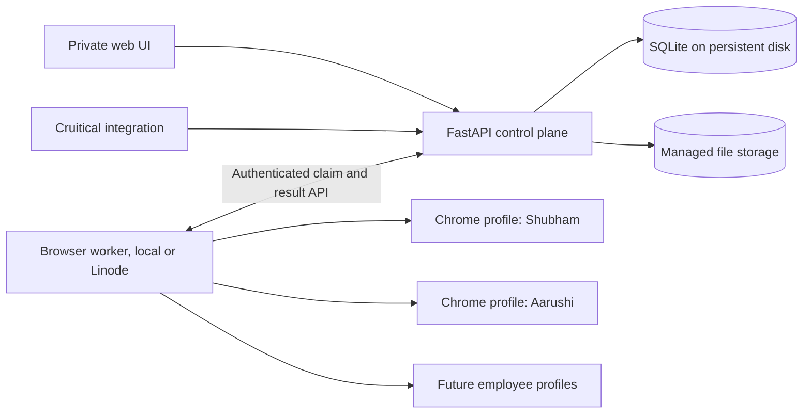

# LinkBound v3 architecture and delivery plan

Status: proposed for founder review, 2026-09-22.

## Outcome

LinkBound becomes a continuously available internal outbound operations system. Shubham can switch among distinct LinkedIn accounts, queue large campaigns, see accepted requests and replies, inspect and export shared files, and promote qualified candidates into Cruitical. Each account retains its own browser login, limits, contact history, and sync health. The existing browser send path remains the reference implementation until a specific defect is reproduced and fixed.

## Evidence and constraints

- The current app has a FastAPI dashboard, a Playwright persistent Chrome context per operator, SQLite contact and batch records, and an MCP and HTTP client. The local database contains completed outbound batches.
- The `contacts` table has one row per URL and one mutable `operator` and `last_status`. This loses account context and can erase dedup evidence. Previewed dedup is not checked again before a send.
- Dashboard runs use per-operator orchestrators. The `/api/v1/enqueue` route uses another global orchestrator. Its batch ID is assigned asynchronously after the route can return.
- Campaign scheduling currently marks a due campaign `running` without target rows or sends. Upload previews live only in process memory.
- The existing dashboard routes, WebSocket, export, and file route have no authentication. The API key protects only `/api/v1/*`.
- The current Dockerfile installs Chromium, while configuration requests headed Google Chrome. Its Playwright image and Python package versions are not pinned together.
- The session picker changes the visible account name, but the current CRM query remains global and limited. The Safety Limits Save control does not persist the entered values.
- LinkedIn says third-party tools that automate activity on its website violate its rules. A headed browser and the user's report of no account notices so far do not establish future non-detection. LinkedIn does not publish 100 daily invitations as a safe allowance. The user-defined cap is an internal ceiling, not a platform guarantee.
- Cruitical's current admin candidate creation and resume upload routes require a human admin credential. Admin creation makes a claimable user, resume upload can overwrite an existing file, and passport regeneration can interrupt an existing run. They are not a safe automatic import contract yet.

## Deployment choices

| Choice | Benefit | Cost or risk | Recommendation |
| --- | --- | --- | --- |
| All components on one Linode VM immediately | Simple operations and always-on browser | New IP and Linux browser environment, so account behavior may change | Pilot only after the control plane is stable |
| Linode control plane plus current local browser worker | Always-on CRM and queue while keeping the known browser setup | Sends and sync wait while the local worker is offline | First production release |
| Approved LinkedIn API integration | Stable provider contract if access is granted | General invitations and communications access is restricted to approved partners; it does not meet the near-term schedule | Explore separately, do not block the first release |

The same worker protocol runs locally or on the VM. Deployment location is configuration, so changing it does not change send decisions, dedup, audit, or scheduling. The first Linode browser pilot checks login and read-only navigation with one account. Autonomous sends move only after a measured pilot and explicit account owner acceptance of the platform risk. If the pilot fails, the local worker remains the sending path.

One API process owns database writes and runs with one Uvicorn worker. A worker never opens the server's SQLite file over a network share. Start with one browser worker and one active browser context at a time. If volume later justifies more workers, database leases and account locks remain the coordination mechanism.

## Data contracts

The [CRM benchmark](linkbound-v3-crm-benchmark.md) checks these records against Attio, Salesforce, HubSpot, EspoCRM, Chatwoot, Mautic, and Twenty. The key boundary is person identity, sender-account relationship, campaign membership, and work execution as four different layers.

1. `accounts`: one LinkedIn sender identity, owner label, timezone, profile location, login state, last sync, pause state, and per-account policy. An account is not an app user or CRM record owner. Shubham is the initial app user and can manage several accounts.
2. `people`, `person_identities`, and `contact_points`: a person has observed provider IDs, profile URL aliases, and source-qualified email addresses. Normalize `www.linkedin.com` and `linkedin.com`, query strings, case, and trailing slashes. Store provider ID uniqueness within its documented scope, and record match confidence. Name alone never merges people; alias collisions become `review_items`.
3. `organizations` and `person_affiliations`: companies and a person's current or past relationship to them are explicit records. Preserve the original CSV company text and source. Create or merge an organization only when identity evidence is sufficient, such as a reliable domain or provider organization ID. A candidate can be linked to a company without becoming a client lead.
4. `account_contacts` and `suppression_rules`: one relationship per `(account_id, person_id)` with account-scoped provider source ID, connection evidence, derived current state, and last observation. A source ID is unique within its account and provider scope. Suppression has scope, reason, source, creator, and optional expiry; a reviewed global rule can block outreach from another account without erasing history.
5. `campaigns`, `campaign_memberships`, and versioned `campaign_steps`: a campaign has an objective (`candidate` or `client`), one sender account in v1, policy, and schedule. A membership is one person's durable enrollment and campaign-specific status, position, role or client context, and source import row. A person may join several campaigns. V1 permits one membership per person per campaign and one outbound step; the step model leaves room for later follow-ups without making a generic workflow engine now.
6. `work_items` and `send_attempts`: a due step execution holds the lease, run ID, and queue state. Each attempt captures the template snapshot, rendered and final sent text, browser evidence, and immutable outcome. Uploading 500 rows creates durable import and membership rows; starting or scheduling never depends on `_UPLOADS` memory.
7. `conversations`, `conversation_participants`, `messages`, and `attachments`: account-scoped provider observations, with account-specific channel identity and external thread/message IDs when available. Preserve timestamps, direction, sender, body, source link, observed time, and match confidence. A weak fingerprint creates review instead of a silent merge. Store attachment name, type, size, SHA-256, download state, source message, and storage path.
8. `activity_events`, `review_items`, `tasks`, and `consent_records`: append-only source-linked facts drive the timeline and derived statuses. Review items persist uncertain sends, identity collisions, unmatched replies, file faults, and promotion conflicts with owner and resolution. Ordinary follow-up tasks have a due time, owner, linked person or conversation, and completion state. Candidate permission evidence is purpose-specific and linked to its source message or human decision.
9. `import_jobs`, `import_rows`, `sync_runs`, and `integration_deliveries`: preserve upload mapping, original row, accepted or rejected reason, per-account sync coverage and cursor, and idempotent Cruitical delivery attempts.

The core relationship is `person -> account_contact -> conversation`; `person -> campaign_membership -> work_item -> send_attempt` is the outbound path. An inbound reply links to its conversation and account contact first. It links to a campaign only when a specific outbound touch supports that attribution or a human reviews it. No CRM status depends on whichever campaign was imported most recently.

Database constraints enforce one membership per `(campaign_id, person_id)` and one work item per `(membership_id, step_id)` in v1. Stable message IDs are unique within the sender account. Fallback fingerprints trigger review when ambiguous. Two messages may reference identical file bytes without collapsing into one received-file record. `activity_events` point to canonical source rows and contain source, occurred time, observed time, and confidence; they do not replace the message or attempt rows.

Statuses are independent facts: `invited`, `accepted`, `replied`, `file_received`, `reviewed`, and `promoted_to_cruitical` can coexist. Campaign membership stage and queue state are separate from these facts. An absent pending invitation is not proof of acceptance. Show the last observed time and source for every inferred status. A failed or skipped attempt cannot remove a prior send. LinkedIn unread and LinkBound unreviewed are separate fields.

Migration first makes a backup and creates versioned schema migrations with Alembic. Use SQLAlchemy Core for new persistence and move legacy `sqlite3` call sites incrementally. Set SQLite transaction mode, foreign keys, WAL, and busy timeout deliberately; keep one API writer process. Reconstruct account-specific historical events from `outbound_requests.operator`. Preserve the old `contacts` row as legacy evidence when ownership or status cannot be reconstructed. Do not invent acceptance, replies, email verification, or organization identity from old rows. Compare legacy and migrated counts before switching reads.

Release A implementation order: add migration and backup tooling; create account, identity, organization, affiliation, account relationship, suppression, review-item, and event tables; backfill from legacy requests with a reconciliation report; change preview and pre-send dedup to query durable attempts/events and suppression; record the final sent body; route dashboard and API starts through one account coordinator; then change contact reads and the session picker to apply an explicit account filter. Add the membership and work-item schema in the same migration series but activate the new queue in Release C. Keep a rollback path to the original tables until the migrated reads and a controlled dry run match expectations.

## Durable queue and browser worker

The queue stores a campaign, imported source rows, memberships, and due work items before scheduling. A work item is claimed in a transaction with a lease and a unique run ID. The worker acquires the account browser lease, refreshes the person state, suppression rules, campaign membership, and account budget, then calls the existing detect, decide, and execute functions. It writes a separate send attempt with the final text actually used, observed outcome, trace, and screenshot. It releases the browser before another run or inbound sync uses the profile. Use one database-backed due-work poller at first; APScheduler can later provide wakeup timing but never owns campaign truth.

There are distinct limits for connection invitations, direct messages, and InMail. The user-set invitation ceiling is at most 100 per account per local calendar day, with a separate configurable rolling seven-day ceiling. Pilot values can be lower. Only confirmed invitation sends count toward the invitation budget; uncertain outcomes reserve capacity until reconciled. A LinkedIn limit warning, login challenge, missing session, or repeated browser failure pauses that account and creates a visible action item. No automatic resend follows a timeout after a possible click.

Work-item states are `draft`, `queued`, `leased`, `sending`, `sent`, `skipped`, `needs_review`, `uncertain`, `failed`, and `cancelled`. A crash during `sending` becomes `uncertain`. Reconciliation checks the profile or conversation before a person can be retried. A campaign can be paused, resumed, or cancelled without changing historical results. Schedule time is stored in UTC with the account's IANA timezone and displayed in local time. Import rows retain mapping errors and rejects; importing the same file again never implicitly resends a person.

The browser adapter stays small and preserves the working selectors and send steps. Changes to the browser path require a captured failing case, a targeted regression test, and a headed test against a controlled account before rollout. The known first-40-character DM duplicate heuristic and broad send confirmation deserve isolated tests; the durable queue must not use either as its primary dedup mechanism.

## Inbound sync and files

A read-only daily job checks each active account's relevant conversations and sent invitations. First release scopes detailed message sync to LinkBound contacts, with durable `review_items` for unmatched inbox threads and a visible coverage count. Repeated syncs must be idempotent using provider IDs scoped to the sender account; fallback fingerprints carry confidence and can require review. The UI distinguishes LinkedIn unread from LinkBound unreviewed. Accepted is recorded only from positive evidence such as first-degree state or an explicit invitation result. The sync records when a section could not be checked rather than presenting old data as current. A reply remains tied to the account contact even if no campaign can be attributed confidently. Shubham can create a dated follow-up task from a conversation without changing its provider unread state.

For attachments, the worker saves the downloaded bytes before closing the browser, computes a checksum, validates file type and size, and links the file to its source message. The UI can inspect one file or export a filtered ZIP with a contact CSV, message JSON, original files, checksums, and provenance. File names never become storage paths directly. A failed download remains visible and retryable without duplicating the message. Resume import initially supports the file types that Cruitical actually accepts; other shared files stay available in LinkBound.

## Cruitical boundary

Receiving a file or accepting a request creates a LinkBound CRM event. It does not by itself create a Cruitical user. Promotion requires a defined candidate permission rule with source evidence, a verified identity and email, a supported resume file, and an idempotent delivery record. Build a narrow machine-authenticated Cruitical endpoint that accepts a LinkBound source ID and provenance, checks for an existing candidate, and returns an existing or newly created candidate ID. Conflicts become durable review items. Never store a human WorkOS admin token in LinkBound or blindly retry an upload that may overwrite a resume.

## Security and operations

Run the control plane behind private HTTPS access, initially Tailscale Serve restricted to Shubham's devices. Add an app session for the human UI and scoped service tokens for worker and Cruitical integration. Authenticate WebSocket, exports, file downloads, and all run controls. Do not expose VNC, Chrome DevTools, or a browser debugging port publicly. Chrome profile directories are credentials; restrict permissions and keep them outside the repository. Back up the database and attachments to an encrypted offsite location, and handle profile backups as credential material. Verify restore, not just backup creation.

The Linode browser pilot uses a non-root service account, a version-matched Playwright installation, the browser channel actually installed, Xvfb for headed Chrome, a persistent profile directory per account, and private remote desktop access for login challenges. Browser location and last successful login are visible in the UI. A process restart reclaims expired leases and marks possible sends `uncertain`; it never restarts them blindly.

## UI direction

Keep the existing campaign preview wizard. Make account context explicit throughout the app. The primary navigation becomes Overview, Campaigns, Inbox, Contacts, Activity, Accounts, and Settings. Overview leads with replies, files, due follow-up tasks, login faults, and uncertain sends needing attention, followed by today's queue per account. Contacts has an explicit All accounts or named account filter, lifecycle facets, campaign filter, server pagination, and a detail pane with the event timeline, messages, files, tasks, and Cruitical promotion state. Campaigns shows draft, queued, running, and finished work with local schedule and remaining account budget. Accounts shows owner, login state, worker location, last sync, and pause control.

Use a restrained operations console treatment: canvas `#F8F8F5`, surface `#FFFFFF`, text `#202820`, muted `#66736A`, Cruitical green `#38613A`, alert `#B45335`, and border `#DCE2DA`. Keep dense tables readable at normal browser zoom. Remove decorative glass and repeated reveal animations. Use real buttons and links, keyboard focus, responsive layouts, and explicit loading, empty, stale, and error states. Status color always has a text label and timestamp.

## Delivery sequence and proof

| Release | Independently usable result | Required proof |
| --- | --- | --- |
| A. Foundation | Versioned migrations, person and organization identities, account-scoped CRM, suppressions, immutable send history, single run coordinator | Two accounts retain separate histories; a later skip cannot erase a prior send; old rows reconcile; ambiguous company and identity matches stay unresolved; no current send regression |
| B. Private control plane | Authenticated Linode web app, persistent data, worker protocol, backups, health and restore | Unauthenticated UI/API/file/WebSocket denied; restart preserves CRM; restore succeeds; local worker completes a controlled dry run |
| C. Scheduled outbound | Durable imports, campaign memberships, versioned steps, work items and attempts, per-account budgets, queue UI, pause and crash recovery | 500 imported rows survive restart with source and rejects; one work item cannot be claimed twice; duplicate upload cannot silently resend; daily and rolling-week ceilings hold; uncertain sends do not auto-retry |
| D. Hosted browser pilot | Headed Linode worker with one account, login recovery, read-only navigation, optional gradual sends | Repeated login and read-only navigation succeed; no profile sharing; account owner reviews pilot evidence before scheduled sends move |
| E. Closed-loop CRM | Daily inbound sync, accepted and reply evidence, account-scoped threads, attachments, review queue and follow-up tasks, bulk export | Two scans create no duplicate messages or files; unattributed replies remain visible; tasks survive restart; stale sync is visible; exported bytes match hashes and source records |
| F. Cruitical promotion | Explicit candidate permission record and narrow idempotent integration | Duplicate delivery yields one candidate; missing email or permission stays in review; existing resume is not overwritten silently |

The first implementation branch should contain Release A only. Later releases depend on its data contracts and can each ship independently. The browser pilot is a gate for moving sends, not a prerequisite for making the CRM and queue available on Linode.

## Founder decisions requested after this plan

1. Should the same person be suppressed across all LinkedIn accounts by default, or only within each account? Recommended: global suppression for outbound, with an explicit reviewed override.
2. Should the first inbound sync cover only LinkBound campaign contacts, or every conversation in each account? Recommended: campaign contacts first, with unmatched conversations listed for review.
3. What counts as permission to add a candidate to Cruitical's network after a resume arrives? Recommended: explicit candidate agreement or a reviewed promotion until the permission wording and API contract are settled.
4. Is a Linode VM browser pilot acceptable even though a headed browser on a new IP cannot preserve the current account behavior as a guarantee? Recommended: deploy the control plane first and keep the known local worker until the pilot is reviewed.
5. Is private Tailscale access acceptable for the internal web UI, or must it open in any browser without a VPN client? Recommended: Tailscale for the first deployment.

## Primary references

- [LinkedIn prohibited software](https://www.linkedin.com/help/linkedin/answer/a1341387) and [invitation limits](https://www.linkedin.com/help/linkedin/answer/a550555)
- [Playwright persistent browser contexts](https://playwright.dev/python/docs/api/class-browsertype), [headed Linux CI](https://playwright.dev/docs/ci), [Docker guidance](https://playwright.dev/python/docs/docker), and [downloads](https://playwright.dev/python/docs/api/class-download)
- [Akamai compute plans](https://techdocs.akamai.com/cloud-computing/docs/how-to-choose-a-compute-instance-plan), [backup service](https://techdocs.akamai.com/cloud-computing/docs/backup-service), and [cloud firewall](https://techdocs.akamai.com/cloud-computing/docs/create-a-cloud-firewall)
- [Tailscale Serve](https://tailscale.com/docs/features/tailscale-serve) and [access control](https://tailscale.com/docs/features/access-control)
- Cruitical product repository `origin/main` at `d946a75e`, especially `apps/backend/api/admin_users.py`, `apps/backend/core/resume.py`, and `apps/backend/core/candidate_analysis.py`
