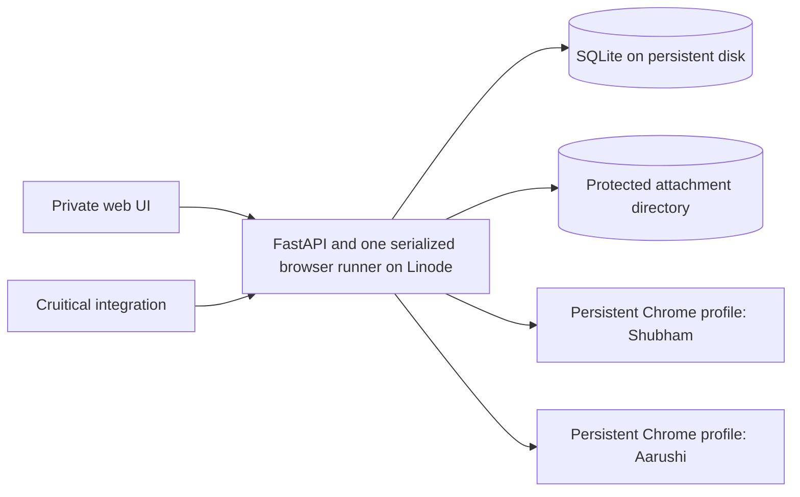

# LinkBound v3 architecture and delivery plan

Status: revised after scope review, 2026-09-22. This is a focused internal operations tool, not a general CRM platform.

## Outcome

LinkBound becomes a continuously available internal outbound operations system. Shubham can switch among distinct LinkedIn accounts, queue large campaigns, see accepted requests and replies, inspect and export shared files, and promote qualified candidates into Cruitical. Each account retains its own browser login, limits, contact history, and sync health. The existing browser send path remains the reference implementation until a specific defect is reproduced and fixed.

## Evidence and constraints

- The current app has a FastAPI dashboard, a Playwright persistent Chrome context per operator, SQLite contact and batch records, and an MCP and HTTP client. The local database contains completed outbound batches.
- The `contacts` table has one row per URL and one mutable `operator` and `last_status`. This loses account context and can erase dedup evidence. Previewed dedup is not checked again before a send.
- Dashboard runs use per-operator orchestrators. The `/api/v1/enqueue` route uses another global orchestrator. Its batch ID is assigned asynchronously after the route can return.
- Campaign scheduling currently marks a due campaign `running` without target rows or sends. Upload previews live only in process memory.
- The existing dashboard routes, WebSocket, export, and file route have no authentication. The API key protects only `/api/v1/*`.
- The current Dockerfile installs Chromium, while configuration requests headed Google Chrome. Its Playwright image and Python package versions are not pinned together.
- The session picker changes the visible account name, but the current CRM query remains global and limited. The Safety Limits Save control does not persist the entered values.
- LinkedIn says third-party tools that automate activity on its website violate its rules. A headed browser and the user's report of no account notices so far do not establish future non-detection. LinkedIn does not publish 100 daily invitations as a safe allowance. The user-defined cap is an internal ceiling, not a platform guarantee.
- Cruitical's current admin candidate creation and resume upload routes require a human admin credential. Admin creation makes a claimable user, resume upload can overwrite an existing file, and passport regeneration can interrupt an existing run. They are not a safe automatic import contract yet.

## Scope guardrails

The [CRM benchmark](linkbound-v3-crm-benchmark.md) gives useful logical distinctions. It is a reference catalog, not a list of tables to implement. The first version serves one app user, a few LinkedIn sender accounts, one outbound action per campaign, daily read-only sync, and one Cruitical handoff. Keep the existing Playwright send path and `sqlite3` persistence. Add a table only when a requested workflow needs independent state or a database constraint.

The first technical proof is a headed Chrome pilot on Linode with one account, persistent profile, and read-only navigation. It happens before a large queue or CRM build. A new IP and Linux environment may change account behavior; the pilot cannot guarantee the present account experience. If it succeeds, host the app, browser, SQLite, and attachments on one private Linode VM. If it fails, a Linode dashboard with the current local browser is a fallback, with the explicit limitation that scheduled sends and sync stop when the local machine is offline. A remote worker protocol is built only if that fallback becomes necessary.

Run one app process and one active browser context at a time. Browser operations and inbound sync share the same account lock. Profile directories are never shared between simultaneous Chrome processes. Keep the local working setup as a rollback path during the hosted pilot.

## Minimum data changes

1. Reuse `operators` as LinkedIn sender accounts and make the UI label clear. Reuse `contacts` for global profile details, but stop using its mutable `operator` and `last_status` as outreach truth. Normalize URL variants consistently; add a URL alias table only if actual redirects or collisions require it.
2. Add `account_contacts` keyed by `(operator, normalized_linkedin_url)` for each sender's relationship and last observed connection state. Reconstruct prior sends from existing `outbound_requests`, never from the latest contact status. A later skip cannot erase a prior send. Cross-account suppression queries confirmed history and an explicit do-not-contact flag; richer suppression policies wait until needed.
3. Reuse `campaigns`. Add durable `campaign_targets` with campaign ID, normalized URL, CSV source row, rendered preview, due time, queue state, lease, and outcome. For one action per campaign, a target can represent both enrollment and queued work. Extend existing `outbound_requests` as immutable attempt records with target ID, sender account, final sent text, and uncertainty evidence. A second campaign can target the same person without creating a second person record.
4. When inbound sync ships, add `conversations`, `messages`, `attachments`, and `sync_runs`, all scoped to the sender account. A conversation can have a nullable contact link while an unmatched reply is reviewed. Keep source timestamps and provider IDs when exposed; ambiguous fingerprints stay visible. Model one-to-one conversations first. Store file bytes outside SQLite and tie every attachment to its source message.
5. When Cruitical promotion ships, add one idempotent `integration_deliveries` record per source promotion. Store the permission decision and evidence used for that delivery. Define the candidate permission rule before automatic imports.

The contact page derives `invited`, `accepted`, `replied`, and `file_received` from the existing request history plus new sync observations. These facts can coexist. Pending invitation disappearance is not acceptance evidence. Display source and last observed time. Keep LinkedIn unread separate from LinkBound reviewed state.

Use Alembic for versioned migrations but keep runtime `sqlite3` until a concrete query or concurrency need justifies SQLAlchemy Core. Back up the SQLite file before migration, enable foreign keys and a deliberate busy timeout, and reconcile legacy request counts. Do not infer account ownership, acceptance, or replies from ambiguous old rows. No broad ORM rewrite is part of the foundation.

## Durable queue and browser worker

The queue stores every target before scheduling. A due target is claimed transactionally with a lease and run ID. The serialized runner refreshes contact history, do-not-contact state, and account budget immediately before using the existing detect, decide, and execute functions. It records the final text actually sent, outcome, trace, and screenshot in `outbound_requests`. One database-backed poller is enough for this volume. A crash after a possible click marks the target uncertain for review.

There are distinct limits for connection invitations, direct messages, and InMail. The user-set invitation ceiling is at most 100 per account per local calendar day, with a separate configurable rolling seven-day ceiling. Pilot values can be lower. Only confirmed invitation sends count toward the invitation budget; uncertain outcomes reserve capacity until reconciled. A LinkedIn limit warning, login challenge, missing session, or repeated browser failure pauses that account and creates a visible action item. No automatic resend follows a timeout after a possible click.

Target states are `draft`, `queued`, `sending`, `sent`, `skipped`, `uncertain`, `failed`, and `cancelled`. A crash during `sending` becomes `uncertain`. Reconciliation checks the profile or conversation before a person can be retried. A campaign can be paused, resumed, or cancelled without changing historical results. Schedule time is stored in UTC with the sender's IANA timezone and displayed in local time. Save the original CSV and a validation report with rejected row numbers. Re-importing a file never implicitly resends a person.

The browser adapter stays small and preserves the working selectors and send steps. Changes to the browser path require a captured failing case, a targeted regression test, and a headed test against a controlled account before rollout. The known first-40-character DM duplicate heuristic and broad send confirmation deserve isolated tests; the durable queue must not use either as its primary dedup mechanism.

## Inbound sync and files

A read-only daily job checks each active sender's relevant conversations and sent invitations. First release scopes detailed message sync to LinkBound contacts and lists unmatched threads for manual linking. Repeated scans use provider IDs when available and flag ambiguous fingerprints. The UI distinguishes LinkedIn unread from LinkBound reviewed. Accepted is recorded only from positive evidence such as first-degree state or an explicit invitation result. The sync records when a section could not be checked rather than presenting old data as current. A reply stays on its account-scoped conversation even if campaign attribution is uncertain. Authenticated API routes expose paginated contact status, messages, file metadata, and downloads alongside the UI.

For attachments, the worker saves the downloaded bytes before closing the browser, computes a checksum, validates file type and size, and links the file to its source message. The UI can inspect one file or export a filtered ZIP with a contact CSV, message JSON, original files, checksums, and provenance. File names never become storage paths directly. A failed download remains visible and retryable without duplicating the message. Resume import initially supports the file types that Cruitical actually accepts; other shared files stay available in LinkBound.

## Cruitical boundary

Receiving a file or accepting a request updates LinkBound's CRM view. It does not by itself create a Cruitical user. Promotion requires a defined candidate permission rule with source evidence, an identity and email that meet the agreed rule, a supported resume file, and an idempotent delivery record. Build a narrow machine-authenticated Cruitical endpoint that accepts a LinkBound source ID and provenance, checks for an existing candidate, and returns an existing or newly created candidate ID. Conflicts stay visible for manual review. Never store a human WorkOS admin token in LinkBound or blindly retry an upload that may overwrite a resume.

## Security and operations

Run the app behind private HTTPS access, initially Tailscale Serve restricted to Shubham's devices. Add an app session for the human UI and a scoped service token when the Cruitical integration ships. Authenticate WebSocket, exports, file downloads, and all run controls. Do not expose VNC, Chrome DevTools, or a browser debugging port publicly. Chrome profile directories are credentials; restrict permissions and keep them outside the repository. Back up the database and attachments to an encrypted offsite location, and handle profile backups as credential material. Verify restore, not just backup creation.

The early Linode browser pilot uses a non-root service account, a version-matched Playwright installation, the browser channel actually installed, Xvfb for headed Chrome, and a persistent profile directory for one account. Add private remote desktop access if login challenges require it. A process restart reclaims expired leases and marks possible sends `uncertain`; it never restarts them blindly.

## UI direction

Keep the existing campaign preview wizard and navigation until the workflows require new screens. First make the account picker filter every contact, campaign, and status view correctly. Then add a queue view and an inbox/status view as those features ship. Overview should show replies, files, login faults, uncertain sends, and today's queue per account. Contacts needs an account filter, pagination, and a detail view with outbound history, messages, files, and Cruitical promotion state. A separate task system, activity page, and general CRM pipeline wait for a demonstrated use case.

Use a restrained operations console treatment: canvas `#F8F8F5`, surface `#FFFFFF`, text `#202820`, muted `#66736A`, Cruitical green `#38613A`, alert `#B45335`, and border `#DCE2DA`. Keep dense tables readable at normal browser zoom. Remove decorative glass and repeated reveal animations. Use real buttons and links, keyboard focus, responsive layouts, and explicit loading, empty, stale, and error states. Status color always has a text label and timestamp.

## Delivery sequence and proof

| Release | Independently usable result | Required proof |
| --- | --- | --- |
| 0. Hosted browser feasibility | Headed Linode Chrome with one persistent profile and read-only navigation | Repeated login and navigation succeed; no profile sharing; account owner reviews pilot evidence before hosted sends |
| A. Account foundation | Versioned migration, account-scoped history and dedup, one run coordinator | Two accounts retain separate histories; a later skip cannot erase a prior send; old rows reconcile; current send path still works |
| B. Private Linode app | Authenticated UI/API, persistent SQLite and files, hosted browser if pilot passes, backups and restore | Unauthenticated UI/API/file/WebSocket denied; restart preserves CRM and login; restore succeeds |
| C. Scheduled outbound | Durable targets, per-account budgets, queue UI, pause and crash recovery | 500 rows survive restart; one target cannot be claimed concurrently by two runners; duplicate import cannot silently resend; limits hold; uncertain sends do not auto-retry |
| D. Closed-loop CRM | Daily inbound sync, accepted and reply evidence, account-scoped threads, attachments, inbox review, bulk export | Two scans create no duplicate messages or files; unmatched replies and stale sync stay visible; exported bytes match hashes and source records |
| E. Cruitical promotion | Agreed candidate permission rule and narrow idempotent integration | Duplicate delivery yields one candidate; missing email or permission stays in review; existing resume is not overwritten silently |

The browser feasibility pilot comes before major queue work because always-on hosted automation is the point of the deployment. It is a gate for hosted sends, not a reason to rewrite the existing browser selectors. The first implementation branch should contain the pilot and Release A only.

## Founder decisions requested after this plan

1. Should the same person be suppressed across all LinkedIn accounts by default, or only within each account? Recommended: global suppression for outbound, with an explicit reviewed override.
2. Should the first inbound sync cover only LinkBound campaign contacts, or every conversation in each account? Recommended: campaign contacts first, with unmatched conversations listed for review.
3. What counts as permission to add a candidate to Cruitical's network after a resume arrives? Recommended: explicit candidate agreement or a reviewed promotion until the permission wording and API contract are settled.
4. Is a Linode VM browser pilot acceptable even though a headed browser on a new IP cannot preserve the current account behavior as a guarantee? Recommended: test read-only navigation early and keep the known local setup as the fallback.
5. Is private Tailscale access acceptable for the internal web UI, or must it open in any browser without a VPN client? Recommended: Tailscale for the first deployment.

## Primary references

- [LinkedIn prohibited software](https://www.linkedin.com/help/linkedin/answer/a1341387) and [invitation limits](https://www.linkedin.com/help/linkedin/answer/a550555)
- [Playwright persistent browser contexts](https://playwright.dev/python/docs/api/class-browsertype), [headed Linux CI](https://playwright.dev/docs/ci), [Docker guidance](https://playwright.dev/python/docs/docker), and [downloads](https://playwright.dev/python/docs/api/class-download)
- [Akamai compute plans](https://techdocs.akamai.com/cloud-computing/docs/how-to-choose-a-compute-instance-plan), [backup service](https://techdocs.akamai.com/cloud-computing/docs/backup-service), and [cloud firewall](https://techdocs.akamai.com/cloud-computing/docs/create-a-cloud-firewall)
- [Tailscale Serve](https://tailscale.com/docs/features/tailscale-serve) and [access control](https://tailscale.com/docs/features/access-control)
- Cruitical product repository `origin/main` at `d946a75e`, especially `apps/backend/api/admin_users.py`, `apps/backend/core/resume.py`, and `apps/backend/core/candidate_analysis.py`
